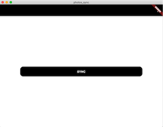
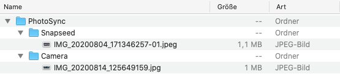

# photos_sync

A Flutter app to sync photos to/from a remote server.

## About

This app has two modes: uploader and downloader, and runs on Android, iOS and macOS.

The *uploader* can choose photos from their device to sync

<table>
    <tr>
        <td></td>
        <td></td>
    </tr>
</table>

while the *downloader* syncs these photos to `~/Downloads/PhotoSync`.

<table>
    <tr>
        <td></td>
        <td></td>
    </tr>
</table>

Note: by default, mobile is considered the uploader, while desktop is the downloader.

## Getting Started

If you would like to build the app yourself, then you simply need:

- Flutter >= 1.20 (master branch)
- Dart >= 2.9
- Xcode >= 11.5
- Android SDK >= 29.0.4
- macOS >= 10.15

Also you need to create a Firebase project and [add it](https://firebase.google.com/docs/flutter/setup) to this Flutter project.

## Contributing

The project isn't actively looking for contributors, however feel free to contact James here on GitHub or [Twitter](https://twitter.com/defuncart).

## Credits

Concept, Design and Programming by James Leahy.
